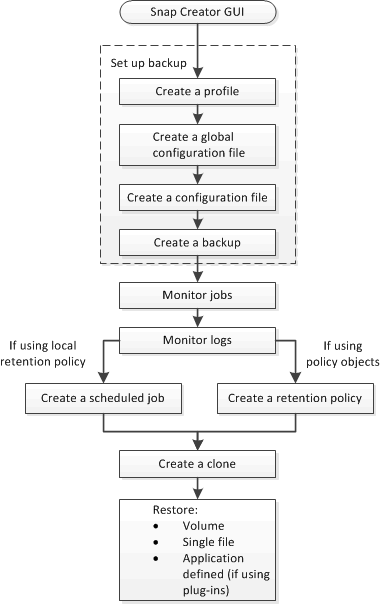

= Fluxo de trabalho de backup e recuperação
:allow-uri-read: 
:icons: font
:imagesdir: ../media/

[role="lead"]
Você pode usar o fluxo de trabalho como uma diretriz para o seu processo de backup e recuperação usando a GUI Snap Creator.

Ao executar essas tarefas, o Snap Creator deve estar em execução e a GUI do Snap Creator deve estar aberta. Se não estiver, você pode inserir o URL do Snap Creator Server em um navegador da Web ("https://IP_address:gui_port"[] por padrão, a porta é 8443) e, em seguida, fazer login usando as credenciais da GUI do Snap Creator.

A ilustração a seguir mostra o conjunto completo de tarefas ao executar um backup e recuperação do sistema ao usar plug-ins:

NOTE: As tarefas descritas no fluxo de trabalho também podem ser executadas a partir da interface de linha de comando (CLI). Para obter detalhes sobre a CLI, consulte as referências relacionadas para obter informações sobre a linha de comando CLI.

*Informações relacionadas*

xref:reference_guidelines_for_using_the_snap_creator_command_line.adoc[Diretrizes para usar a interface de linha de comando Snap Creator]
