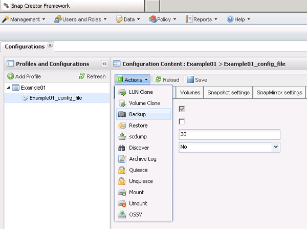

= Criação de backups
:allow-uri-read: 
:icons: font
:imagesdir: ../media/

[role="lead"]
Você pode criar backups usando a GUI do Snap Creator.

Uma das seguintes condições deve ser cumprida:

* Uma política de backup deve ser definida no arquivo de configuração; ou
* Um objeto de política deve ser configurado e atribuído ao perfil.
+

NOTE: Se um objeto de política for definido, ele substituirá todas as entradas que possam estar no arquivo de configuração.

+
.. No menu principal da GUI Snap Creator, selecione *Gerenciamento* > *Configurações*.
.. Na guia *Configurações*, no painel *Perfis e Configuração*, selecione o arquivo de configuração.
.. Selecione *ações* > *Backup*.
+

.. Na caixa de diálogo parâmetros adicionais, selecione a política e clique em *OK* para iniciar o backup.
+

NOTE: Se nenhuma política criada pelo usuário for atribuída à configuração, as seleções disponíveis na lista suspensa *Política* são hora, diária, semanal e mensal. Se uma ou mais políticas criadas pelo usuário tiverem sido atribuídas à configuração, elas serão exibidas na lista suspensa *Política*.

+
image::../media/additional_parameters.gif[parâmetros adicionais]

.. Verifique se as informações sobre o trabalho de backup são exibidas no painel *Console*.
+
image::../media/console_area_backup.gif[backup da área do console]

+
Neste exemplo, a saída indica que a operação Snap Creator foi concluída com sucesso.

+

NOTE: O painel *Console* exibe apenas as informações mais pertinentes; esse é o modo verboso. Para ver informações detalhadas sobre o trabalho que acabou de ser executado, selecione *relatórios* > *Logs* na parte superior da página. Na vista Logs (Logs), é possível selecionar o perfil, o ficheiro de configuração, o tipo de registo e o registo específico.

