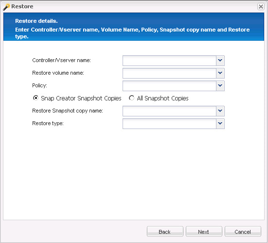

= Executando operações de restauração de arquivo único
:allow-uri-read: 
:icons: font
:imagesdir: ../media/

[role="lead"]
Você pode executar operações de restauração de arquivo único usando a GUI do Snap Creator.

. No menu principal da GUI do Snap Creator, selecione *Gerenciamento* > *Configurações*.
. Na guia Configurações no painel Perfis e Configuração, selecione o arquivo de configuração.
. Selecione *Ação* > *Restaurar*.
+
O assistente Restaurar é aberto no painel direito.

. Conclua o assistente de restauração:
+
.. Na seção ""Restaurar detalhes"", selecione um nome de controlador ou SVM, um nome de volume de restauração, uma política e um nome de cópia Snapshot de restauração e, em seguida, selecione *Restauração de arquivo único* na lista tipo de restauração.
+

.. Selecione os arquivos que serão restaurados.
.. Selecione o local para o qual os arquivos devem ser restaurados.
.. Revise o resumo e clique em *Finish*.

+
É apresentada uma mensagem de aviso, perguntando se existem mais itens a restaurar.

. Clique em *não* se não houver mais itens a serem restaurados e, em seguida, clique em *OK* na página de confirmação Restaurar.
. No painel Console, verifique se os arquivos selecionados foram restaurados com êxito revisando as mensagens exibidas.

