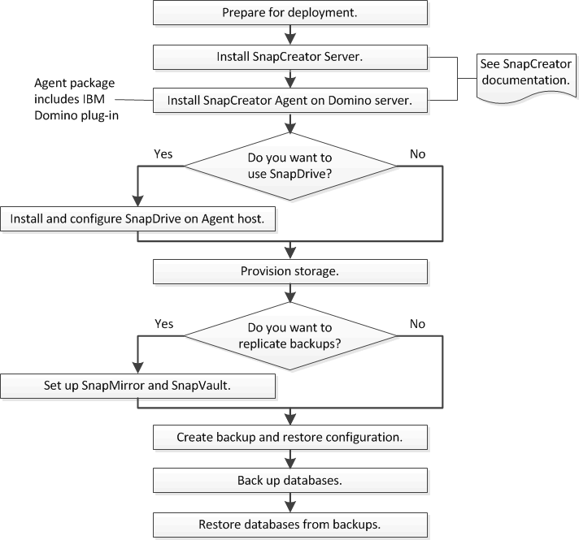

= Fluxo de trabalho de backup e recuperação do IBM Domino
:allow-uri-read: 
:icons: font
:imagesdir: ../media/

[role="lead"]
Antes de criar backups com o plug-in IBM Domino, é necessário instalar o software Snap Creator Server e Agent e provisionar o storage NetApp. Se você planeja replicar cópias Snapshot para um storage secundário para recuperação e arquivamento de desastres, precisará configurar relacionamentos SnapMirror e SnapVault.

NOTE: Especialmente em um ambiente SAN, talvez você queira usar o SnapDrive no host do Snap Creator Agent para fazer backup de bancos de dados ou montar cópias Snapshot para restaurações de um único arquivo. Para obter mais informações, xref:concept_adding_commands_to_the_backup_and_restore_configuration.adoc[Adicionando comandos à configuração de backup e restauração]consulte e xref:concept_single_file_restore_in_fc_iscsi_environments.adoc[Executar uma restauração de arquivo único em um ambiente SAN].

