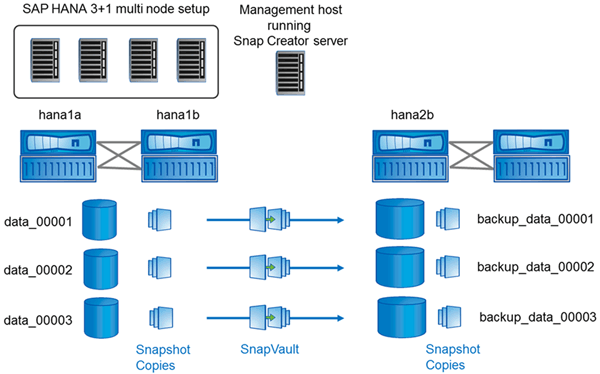

= Suposições de configuração neste guia
:allow-uri-read: 
:icons: font
:imagesdir: ../media/

[role="lead"]
Embora uma instalação típica do Snap Creator assuma que o servidor está instalado em um host e o Agente está instalado em um host diferente, a configuração usada neste guia é baseada em um dispositivo multinode SAP HANA.

Nessa configuração, o banco de dados SAP HANA é executado em uma configuração de nó de banco de dados de mais de 3 1 e todos os componentes de software Snap Creator - servidor, agente e plug-in - são instalados no mesmo host.

Os sistemas de armazenamento NetApp usados nesta configuração estão executando o Data ONTAP operando no modo 7. Um par de controladores de alta disponibilidade (HA) é usado na camada de storage. Os volumes de dados e log dos três nós de banco de dados do SAP HANA são distribuídos para ambas as controladoras de storage. Com o exemplo de configuração, um controlador de storage de outro par de controladores de HA é usado como storage secundário. Cada volume de dados é replicado para um volume de backup dedicado no storage secundário. O tamanho dos volumes de backup depende do número de backups que serão mantidos no storage secundário.

Todas as operações do Snap Creator e do SAP HANA Studio descritas aqui são as mesmas com os sistemas de storage que executam o Clustered Data ONTAP. No entanto, a configuração inicial do SnapVault nos sistemas de storage e todos os comandos do SnapVault que precisam ser executados diretamente no storage são diferentes com o Clustered Data ONTAP. As diferenças são destacadas e descritas neste guia.

A figura a seguir mostra os volumes de dados no storage primário e o caminho de replicação para o storage secundário:

NOTE: Todos os volumes que precisam ser copiados devem ser criados no controlador de storage secundário. Neste exemplo, os volumes backup_data_00001, backup_data_00002 e backup_data_00003 são criados no controlador de armazenamento secundário.
