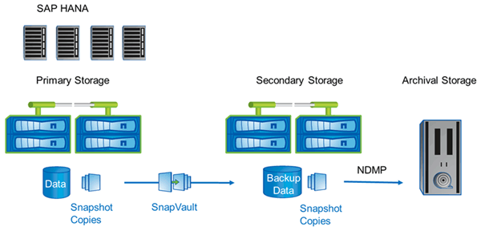

= A solução NetApp
:allow-uri-read: 
:icons: font
:imagesdir: ../media/

[role="lead"]
Um backup de banco de dados pode ser criado em minutos usando a tecnologia NetApp Snapshot. O tempo necessário para criar uma cópia Snapshot não depende do tamanho do banco de dados, pois a cópia Snapshot não move blocos de dados.

O uso da tecnologia Snapshot também não afeta a performance do sistema SAP de produção. Portanto, a criação de cópias Snapshot pode ser programada sem considerar os períodos de atividade de pico. Em geral, os clientes da SAP e da NetApp agendam vários backups de Snapshot on-line durante o dia. Por exemplo, backups podem ocorrer a cada quatro horas. Esses backups Snapshot costumam ser mantidos por três a cinco dias no sistema de storage primário.

As cópias Snapshot também oferecem vantagens importantes para a operação de restauração e recuperação. A funcionalidade NetApp SnapRestore permite restaurar todo o banco de dados ou partes do banco de dados até o momento em que qualquer cópia Snapshot disponível foi criada. Esse processo de restauração é feito em poucos minutos, independentemente do tamanho do banco de dados. O tempo necessário para o processo de recuperação também é reduzido drasticamente, porque várias cópias Snapshot foram criadas durante o dia e menos logs precisam ser aplicados.

Os backups de snapshot são armazenados no mesmo sistema de disco que os dados on-line ativos. Portanto, a NetApp recomenda o uso de backups Snapshot como um suplemento, e não um substituto para backups em um local secundário, como disco ou fita. Embora os backups para um local secundário ainda sejam necessários, há apenas uma pequena probabilidade de que esses backups sejam necessários para restauração e recuperação. A maioria das ações de restauração e recuperação é tratada com o SnapRestore no sistema de storage primário. As restaurações de um local secundário só serão necessárias se o sistema de storage primário que armazena as cópias Snapshot estiver danificado ou se for necessário restaurar um backup que não esteja mais disponível a partir de uma cópia Snapshot. Por exemplo, talvez seja necessário restaurar um backup de duas semanas atrás.

Um backup em um local secundário é sempre baseado em cópias Snapshot criadas no storage primário. Portanto, os dados são lidos diretamente do sistema de armazenamento primário sem gerar carga no servidor de banco de dados SAP. O storage primário se comunica diretamente com o storage secundário e envia os dados de backup para o destino usando o backup disco a disco do SnapVault. A funcionalidade do NetApp SnapVault oferece vantagens significativas em comparação com os backups tradicionais. Após uma transferência inicial de dados, na qual todos os dados devem ser transferidos da origem para o destino, todos os backups subsequentes copiam apenas os blocos alterados para o armazenamento secundário. Isso reduz significativamente a carga no sistema de storage primário e o tempo necessário para um backup completo. Um backup completo do banco de dados requer menos espaço em disco, pois o SnapVault armazena apenas os blocos alterados no destino.

Fazer backup de dados para fita, pois um backup de longo prazo ainda pode ser necessário. Isso pode ser, por exemplo, um backup semanal que é mantido por um ano. Nesse caso, a infraestrutura de fita pode ser conetada diretamente ao storage secundário e os dados podem ser gravados em fita usando o Network Data Management Protocol (NDMP).

