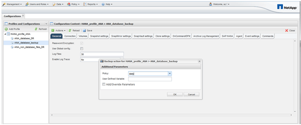

= Fazer backup do banco de dados com a GUI Snap Creator
:allow-uri-read: 
:icons: font
:imagesdir: ../media/

[role="lead"]
Você pode fazer backup de um banco de dados com a GUI do Snap Creator.

. Selecione a configuração *HANA_database_backup* e selecione *ações* > *Backup*.
+
image::../media/sap_hana_db_backup.gif[Esta imagem é explicada pelo texto circundante.]

. Selecione a política de backup e clique em *OK*.
+

+
A cópia de segurança é iniciada. O Snap Creator aciona a "'atualização do SnapVault'" e o Snap Creator aguarda até que os dados sejam replicados para o storage secundário. O tempo de espera foi configurado durante a configuração e pode ser adaptado no separador Definições do SnapVault. O Snap Creator aciona as atualizações do SnapVault em paralelo para cada volume no mesmo controlador de storage, mas em sequência para cada controlador de storage.

+
image::../media/sap_hana_database_backup2_scfw_gui.gif[Esta imagem é explicada pelo texto circundante.]

