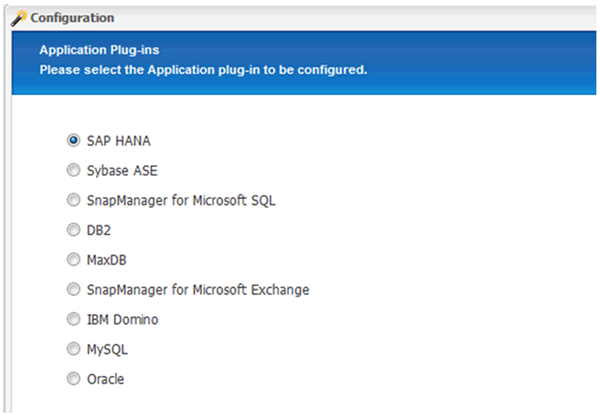
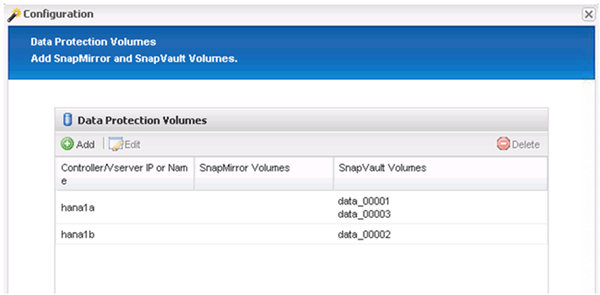

= Configurando o backup do banco de dados do Snap Creator Framework e do SAP HANA
:allow-uri-read: 
:icons: font
:imagesdir: ../media/

[role="lead"]
Você deve configurar o Snap Creator Framework e o backup do banco de dados SAP HANA.

. Conete-se à interface gráfica do usuário (GUI) do Snap Creator https://host:8443/ui/[]: .
. Inicie sessão utilizando o nome de utilizador e a palavra-passe que foram configurados durante a instalação. Clique em *entrar*.
+
image::../media/snap_creator_gui.gif[Mostra o login da GUI do Snap Creator]

. Insira um nome de perfil e clique em *OK*.
+
image::../media/sap_hana_user_profile.gif[perfil de usuário do sap hana]

+
Por exemplo, "ANA" é o SID do banco de dados.

. Introduza o nome da configuração e clique em *seguinte*.
+
image::../media/sap_hana_gui_for_configuration_name.gif[Mostra o nome de configuração introduzido no campo]

. Selecione *Application plug-in* como o tipo de plug-in e clique em *Next*.
+
image::../media/sap_hana_config_plugin_type.gif[mostra select application plug-in (selecionar plug-in da aplicação)]

. Selecione *SAP HANA* como o plug-in do aplicativo e clique em *Next*.
+

. Introduza os seguintes detalhes de configuração:
+
.. Selecione *Yes* no menu suspenso para usar a configuração com um banco de dados multitenant. Para um único banco de dados de contentor, selecione *não*.
.. Se o recipiente de banco de dados multitenant estiver definido como *não*, você deverá fornecer o SID do banco de dados.
.. Se o recipiente de banco de dados multitenant estiver definido como *Sim*, você deverá adicionar as chaves de armazenamento de hdbuserstore para cada nó SAP HANA.
.. Adicione o nome do banco de dados do locatário.
.. Adicione os nós HANA nos quais a instrução hdbsql deve ser executada.
.. Insira o número da instância do NÓ HANA.
.. Forneça o caminho para o arquivo executável hdbsql.
.. Adicione o usuário OSDB.
.. Selecione *Yes* na lista suspensa para ativar a Limpeza DE LOG.
+
NOTA:

+
*** O parâmetro `HANA_SID` só está disponível se o valor do parâmetro `HANA_MULTITENANT_DATABASE` estiver definido como `N`
*** Para contentores de banco de dados multitenant (MDC) com um tipo de recurso ""Single Tenant""", as cópias SAP HANA Snapshot funcionam com autenticação baseada em UserStore Key. Se o `HANA_MULTITENANT_DATABASE` parâmetro estiver definido como `Y`, o `HANA_USERSTORE_KEYS` parâmetro deve ser definido para o valor apropriado.
*** Semelhante aos contentores de banco de dados não-multitenant, o recurso de backup baseado em arquivo e verificação de integridade é suportado

.. Clique em *seguinte*.

+
image::../media/file_based_backup_configuration.gif[configuração de backup baseada em arquivo]

. Ative a operação de cópia de segurança baseada em ficheiros:
+
.. Defina a localização da cópia de segurança do ficheiro.
.. Especifique o prefixo de backup de arquivo.
.. Marque a caixa de seleção *Enable File-Backup* (Ativar backup de arquivos*).
.. Clique em *seguinte*.
+
image::../media/enable_file_based_backup.gif[ativar cópia de segurança baseada em ficheiros]

. Ative a operação Verificação da integridade da base de dados:
+
.. Defina a localização temporária File-Backup (cópia de segurança de ficheiros temporária).
.. Marque a caixa de seleção *Enable DB Integrity Check*.
.. Clique em *seguinte*.

+
image::../media/integrity_checks.gif[Verificação de integridade da base de dados]

. Insira os detalhes do parâmetro de configuração do agente e clique em *Next*.
+
image::../media/sap_hana_agent_configuration_parameter.gif[Esta imagem é explicada pelo texto circundante.]

. Insira as configurações de conexão de armazenamento e clique em *Next*.
+
image::../media/sap_hana_storage_connect_gui.gif[Esta imagem é explicada pelo texto circundante.]

. Insira as credenciais de login de armazenamento e clique em *Next*.
+
image::../media/sap_hana_storage_login_credentials_gui.gif[Esta imagem é explicada pelo texto circundante.]

. Selecione os volumes de dados armazenados neste controlador de armazenamento e clique em *Guardar*.
+
image::../media/sap_hana_select_data_volumes.gif[Esta imagem é explicada pelo texto circundante.]

. Clique em *Add* para adicionar outro controlador de armazenamento.
+
image::../media/sap_hana_add_controller.gif[Esta imagem é explicada pelo texto circundante.]

. Insira as credenciais de login de armazenamento e clique em *Next*.
+
image::../media/sap_hana_storage_login_credentials2.gif[Esta imagem é explicada pelo texto circundante.]

. Selecione os volumes de dados armazenados no segundo controlador de armazenamento que você criou e clique em *Salvar*.
+
image::../media/sap_hana_controller_volumes_selection.gif[Esta imagem é explicada pelo texto circundante.]

. A janela credenciais de controlador/SVM exibe os controladores de armazenamento e volumes adicionados. Clique em *seguinte*.
+
image::../media/sap_hana_view_storage_credentials.gif[Esta imagem é explicada pelo texto circundante.]

. Insira a política de snapshot e a configuração de retenção.
+
A retenção de três cópias Snapshot diárias e de oito por hora é apenas um exemplo e pode ser configurada de maneira diferente, dependendo dos requisitos do cliente.

+

NOTE: Selecione *Timestamp* como a convenção de nomenclatura. O uso da convenção de nomenclatura *recente* não é compatível com o plug-in SAP HANA, porque o carimbo de data/hora da cópia Snapshot também é usado para as entradas do catálogo de backup do SAP HANA.

+
image::../media/sap_hana_snapshot_details_gui.gif[Esta imagem é explicada pelo texto circundante.]

. Não são necessárias alterações. Clique em *seguinte*.
+
image::../media/sap_hana_snapshot_details_continued_gui.gif[Esta imagem é explicada pelo texto circundante.]

. Selecione *SnapVault* e configure as políticas de retenção do SnapVault e o tempo de espera do SnapVault.
+
image::../media/sap_hana_data_protection_gui.gif[Esta imagem é explicada pelo texto circundante.]

. Clique em *Add*.
+
image::../media/sap_hana_data_protection_volumes.gif[Esta imagem é explicada pelo texto circundante.]

. Selecione um controlador de armazenamento de origem na lista e clique em *seguinte*.
+
image::../media/sap_hana_dp_volumes_gui_select_storage_controller.gif[Esta imagem é explicada pelo texto circundante.]

. Selecione todos os volumes armazenados no controlador de armazenamento de origem e clique em *Save*.
+
image::../media/sap_hana_volume_selection_gui.gif[Esta imagem é explicada pelo texto circundante.]

. Clique em *Adicionar*, selecione o segundo controlador de armazenamento de origem na lista e, em seguida, clique em *seguinte*.
+
image::../media/sap_hana_configuration_data_protection_volumes_select_controller.gif[Esta imagem é explicada pelo texto circundante.]

. Selecione todos os volumes armazenados no segundo controlador de armazenamento de origem e clique em *Save*.
+
image::../media/sap_hana_data_protection_volume_selection.gif[Esta imagem é explicada pelo texto circundante.]

. A janela volumes de proteção de dados exibe todos os volumes que devem ser protegidos na configuração que você criou. Clique em *seguinte*.
+

. Insira as credenciais para os controladores de armazenamento de destino e clique em *Next*. Neste exemplo, as credenciais de usuário "root" são usadas para acessar o sistema de armazenamento. Normalmente, um usuário de backup dedicado é configurado no sistema de storage e é usado com o Snap Creator.
+
image::../media/sap_hana_data_protection_relationships_gui.gif[Esta imagem é explicada pelo texto circundante.]

. Clique em *seguinte*.
+
image::../media/sap_hana_dfm_oncommand_settings_gui.gif[GUI de configuração DFM/OnCommand. Esta imagem é explicada pelo texto circundante.]

. Clique em *Finish* para concluir a configuração.
+
image::../media/sap_hana_data_protection_configuration_summary.gif[Esta imagem é explicada pelo texto circundante.]

. Clique no separador *SnapVault settings* (Definições de configuração).
. Selecione *Yes* na lista suspensa da opção *SnapVault Restore Wait* e clique em *Save*.
+
image::../media/sap_hana_snapvault_settings_gui.gif[Esta imagem é explicada pelo texto circundante.]

+
Recomenda-se que utilize uma rede dedicada para o tráfego de replicação. Se você decidir fazer isso, você deve incluir essa interface no arquivo de configuração do Snap Creator como uma interface secundária.

+
Você também pode configurar interfaces de gerenciamento dedicadas para que o Snap Creator possa acessar a origem ou o sistema de storage de destino usando uma interface de rede que não esteja vinculada ao nome de host da controladora de storage.

+
[listing]
----
mgmtsrv01:/opt/NetApp/Snap_Creator_Framework_411/scServer4.1.1c/engine/configs/HANA_profile_ANA
# vi ANA_database_backup.conf

#####################################################################
########################
#     Connection Options                                            #
#####################################################################
########################
PORT=443
SECONDARY_INTERFACES=hana1a:hana1a-rep/hana2b;hana1b:hana1b-rep/hana2b
MANAGEMENT_INTERFACES=hana2b:hana2b-mgmt
----

