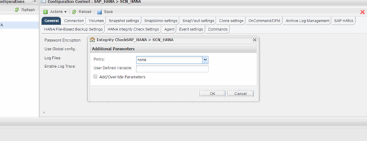

= Executando verificações de integridade de banco de dados da GUI do Snap Creator
:allow-uri-read: 
:icons: font
:imagesdir: ../media/

[role="lead"]
Você pode executar verificações de integridade de banco de dados a partir da interface gráfica do usuário (GUI) do Snap Creator.

Você deve ter habilitado o parâmetro Verificação de integridade do banco de dados na guia Configurações de verificação de integridade DO HANA.

. Selecione a configuração HANA_database_integrity_check.
. Selecione *ações* > *Verificação de integridade*.
+
image::../media/performing_file_based_backup_with_gui.gif[Executando backup baseado em arquivos com GUI]

. Defina a opção Política como *nenhum* e clique em *OK*.
+

