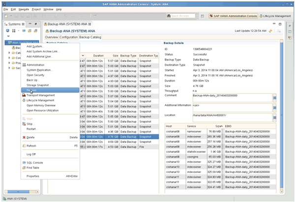
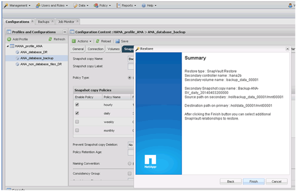

= Restauração e recuperação de bancos de dados do storage secundário
:allow-uri-read: 
:icons: font
:imagesdir: ../media/

[role="lead"]
Você pode restaurar e recuperar o banco de dados do storage secundário.

. No SAP HANA Studio, selecione *Recover* para o sistema SAP HANA.
+

+
O sistema SAP HANA será encerrado.

. Selecione o tipo de recuperação e clique em *Next*.
+
image::../media/sap_hana_secondary_specify_recovery_type.gif[Esta imagem é explicada pelo texto circundante.]

. Forneça locais de backup de log e clique em *Next*.
+
image::../media/sap_hana_secondary_log_backup_locations.gif[Esta imagem é explicada pelo texto circundante.]

+
A lista de backups disponíveis é exibida com base no conteúdo do catálogo de backup.

. Selecione a cópia de segurança necessária e anote a ID de cópia de segurança externa.
+
image::../media/sap_hana_recover_secondary_select_backup.gif[Esta imagem é explicada pelo texto circundante.]

. Vá para a GUI do Snap Creator.
. Selecione o sistema SAP HANA e clique em *ações* > *Restaurar*.
+
image::../media/sap_hana_secondary_select_backup_restore.gif[Esta imagem é explicada pelo texto circundante.]

+
É apresentado o ecrã Welcome (bem-vindo).

+
image::../media/sap_hana_secondary_welcome_screen.gif[Esta imagem é explicada pelo texto circundante.]

. Clique em *seguinte*.
. Selecione *secundário* e clique em *seguinte*.
+
image::../media/sap_hana_secondary_restore.gif[Esta imagem é explicada pelo texto circundante.]

. Introduza as informações necessárias. O nome do Snapshot está correlacionado com o ID de backup selecionado no SAP HANA Studio.
+
image::../media/sap_hana_select_backup_restore04_secondary_scf_gui.gif[Esta imagem é explicada pelo texto circundante.]

. Selecione *Finish*.
+

. Clique em *Sim* para adicionar mais itens para restaurar.
+
image::../media/sap_hana_secondary_snapshot_settings_warning.gif[Esta imagem é explicada pelo texto circundante.]

. Forneça as informações necessárias para todos os volumes que precisam ser restaurados. Na configuração data_00001, data_00002 e data_00003 precisam ser selecionados para o processo de restauração.
+
image::../media/sap_hana_secondary_snapvault_restore.gif[Esta imagem é explicada pelo texto circundante.]

. Quando todos os volumes estiverem selecionados, selecione *OK* para iniciar o processo de restauração.
+
Aguarde até que o processo de restauração esteja concluído.

. Em cada nó do banco de dados, remonte todos os volumes de dados para limpar as "alças de NFS obsoletas".
+
No exemplo, todos os três volumes precisam ser remontados em cada nó do banco de dados.

+
[listing]
----
mount -o remount /hana/data/ANA/mnt00001
mount -o remount /hana/data/ANA/mnt00002
mount -o remount /hana/data/ANA/mnt00003
----
. Vá para o SAP HANA Studio e clique em *Refresh* para atualizar a lista de backup.
+
image::../media/sap_hana_secondary_select_backup_to_recover.gif[Esta imagem é explicada pelo texto circundante.]

. O backup que foi restaurado com o Snap Creator é mostrado com um ícone verde na lista de backups. Selecione a cópia de segurança e clique em *seguinte*.
. Selecione outras definições conforme necessário e clique em *seguinte*.
+
image::../media/sap_hana_secondary_other_settings.gif[Esta imagem é explicada pelo texto circundante.]

. Clique em *Finish*.
+

+
O processo de recuperação começa.

+
image::../media/sap_hana_secondary_recovery_progress_information.gif[Esta imagem é explicada pelo texto circundante.]

. Depois que o processo de recuperação for concluído, retome as relações SnapVault, se necessário.
+
image::../media/sap_hana_secondary_recovery_execution_summary.gif[Esta imagem é explicada pelo texto circundante.]

