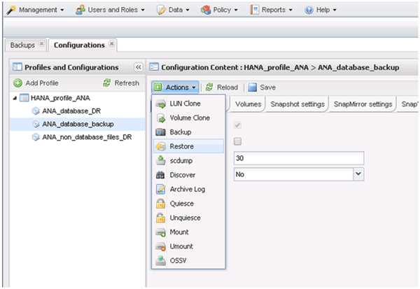

= Restaurar e recuperar bancos de dados do storage primário
:allow-uri-read: 
:icons: font
:imagesdir: ../media/

[role="lead"]
Você pode restaurar e recuperar o banco de dados do armazenamento primário.

NOTE: Não é possível restaurar cópias de backup baseadas em arquivo do Snap Creator.

. No SAP HANA Studio, selecione *Recover* para o sistema SAP HANA.
+
image::../media/sap_hana_recover_primary_gui.gif[Esta imagem é explicada pelo texto circundante.]

+
O sistema SAP HANA é encerrado.

. Selecione o tipo de recuperação e clique em *Next*.
+
image::../media/sap_hana_specify_recovery_type_gui.gif[Esta imagem é explicada pelo texto circundante.]

. Forneça os locais de backup de log e clique em *Next*.
+
image::../media/sap_hana_recover_primary_log_backup_location.gif[Esta imagem é explicada pelo texto circundante.]

+
A lista de backups disponíveis que você vê é baseada no conteúdo do catálogo de backup.

. Selecione a cópia de segurança necessária e registe a ID da cópia de segurança externa.
+
image::../media/sap_hana_recovery_primary_select_backup.gif[Esta imagem é explicada pelo texto circundante.]

. Desative a relação SnapVault.
+

NOTE: Esta etapa é necessária somente com o Clustered Data ONTAP.

+
Se você precisar restaurar uma cópia Snapshot mais antiga do que a cópia Snapshot usada atualmente como a cópia Snapshot de base para SnapVault, primeiro desative a relação SnapVault no Clustered Data ONTAP. Para fazer isso, execute os seguintes comandos no console do cluster de backup:

+
[listing]
----
hana::> snapmirror quiesce -destination-path hana2b:backup_hana_data
Operation succeeded: snapmirror quiesce for destination hana2b:backup_hana_data.

hana::> snapmirror delete -destination-path hana2b:backup_hana_data
Operation succeeded: snapmirror delete the relationship with destination hana2b:backup_hana_data.

hana::> snapmirror release -destination-path hana2b:backup_hana_data
[Job 6551] Job succeeded: SnapMirror Release Succeeded
----
. Na GUI do Snap Creator, selecione o sistema SAP HANA e, em seguida, selecione *ações* > *Restaurar*.
+

+
A tela bem-vindo ao Assistente de restauração do Snap Creator Framework é exibida.

. Clique em *seguinte*.
+
image::../media/sap_hana_primary_restore_welcome_screen.gif[Esta imagem é explicada pelo texto circundante.]

. Selecione *Primary* e clique em *Next*.
+
image::../media/sap_hana_primary_restore_primary_select.gif[Esta imagem é explicada pelo texto circundante.]

. Selecione restaurar a partir do armazenamento primário.
. Selecione o controlador de storage, o nome do volume e o nome do instantâneo.
+
O nome do Snapshot está correlacionado com o ID do backup selecionado no SAP HANA Studio.

+
image::../media/sap_hana_select_backup_restore_scf_gui.gif[Esta imagem é explicada pelo texto circundante.]

. Clique em *Finish*.
+
image::../media/sap_hana_primary_restore_summary.gif[Esta imagem é explicada pelo texto circundante.]

. Clique em *Yes* para adicionar mais itens de restauração.
+
image::../media/sap_hana_add_more_restore_items.gif[Esta imagem é explicada pelo texto circundante.]

. Selecione o controlador de storage, o nome do volume adicional e o nome do instantâneo.
+
O nome do Snapshot está correlacionado com o ID do backup selecionado no SAP HANA Studio.

+
image::../media/sap_hana_primary_select_restore_details.gif[Esta imagem é explicada pelo texto circundante.]

. Repita as etapas de 10 a 13 até que todos os volumes necessários sejam adicionados; em nosso exemplo, data_00001, data_00002 e data_00003 precisam ser selecionados para o processo de restauração.
. Quando todos os volumes estiverem selecionados, clique em *OK* para iniciar o processo de restauração.
+
image::../media/sap_hana_select_volume_restore.gif[Esta imagem é explicada pelo texto circundante.]

+
O processo de restauração é iniciado.

+
image::../media/sap_hana_primary_general_restore_process_in_progress.gif[Esta imagem é explicada pelo texto circundante.]

+
Aguarde até que o processo de restauração esteja concluído.

. Em cada nó do banco de dados, remonte todos os volumes de dados para limpar as alças de NFS obsoletas.
+
No exemplo, todos os três volumes precisam ser remontados em cada nó do banco de dados.

+
[listing]
----
mount -o remount /hana/data/ANA/mnt00001
mount -o remount /hana/data/ANA/mnt00002
mount -o remount /hana/data/ANA/mnt00003
----
. Vá para o SAP HANA Studio e clique em *Refresh* para atualizar a lista de backups disponíveis.
+
image::../media/sap_hana_primary_select_backup.gif[Esta imagem é explicada pelo texto circundante.]

+
O backup que foi restaurado com o Snap Creator é mostrado com um ícone verde na lista de backups.

. Selecione a cópia de segurança e clique em *seguinte*.
+
image::../media/sap_hana_select_backup_to_recover_database.gif[Esta imagem é explicada pelo texto circundante.]

. Selecione outras definições conforme necessário e clique em *seguinte*.
+
image::../media/sap_hana_select_backup_other_settings.gif[Esta imagem é explicada pelo texto circundante.]

. Clique em *Finish*.
+
image::../media/sap_hana_primary_review_recory_settings.gif[Esta imagem é explicada pelo texto circundante.]

+
O processo de recuperação começa.

+
image::../media/sap_hana_primary_recovery_progress_information.gif[Esta imagem é explicada pelo texto circundante.]

. Após a conclusão da recuperação, retome as relações SnapVault, se necessário.
+
image::../media/sap_hana_primary_recovery_execution_summary.gif[Esta imagem é explicada pelo texto circundante.]

